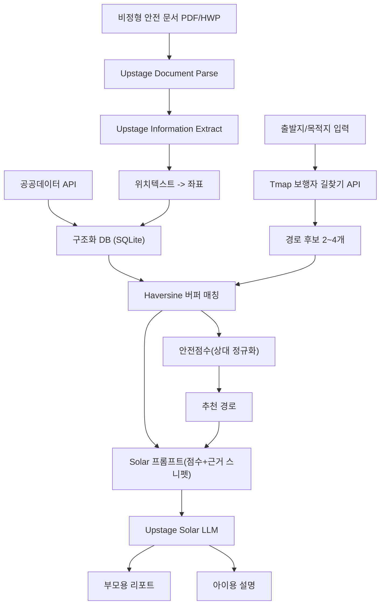

# AI 어린이 안심 길찾기 서비스 — 프로젝트 기획서

> AI Document Builders Challenge 제출용 기획서 (중간산출물, 2026-07-15 작성)
> 팀 목표: 2026-07-24 코드 MVP 완성, 2026-07-25 발표

## 1. 서비스 개요

기존 지도 서비스(카카오맵/티맵)는 최단거리·최단시간을 추천하지만, 어린이 통학로에서는 "가장 안전한 길"이 더 중요하다. 본 서비스는 공공데이터(어린이보호구역·CCTV·교통사고다발지역)와 지자체가 발간하는 비정형 안전 문서(통학로 안전진단 보고서 등)를 결합해 경로 후보별 안전점수를 계산하고, Upstage Solar LLM이 그 근거를 부모용/아이용으로 각각 다르게 설명해주는 서비스다.

**대상**: 유치원생·초등학생·중학생 자녀를 둔 부모, 통학 아동.

## 2. 문제 정의와 차별화 (Service Differentiation)

| 비교 대상 | 한계 | 우리 서비스 |
| --- | --- | --- |
| 카카오맵/티맵 | 최단거리·최단시간만 최적화, 안전 개념 없음 | 안전점수 기반 경로 재순위화 |
| 범용 LLM(ChatGPT 등) | 실제 데이터 근거 없이 그럴듯한 답변(환각 위험) | 공공데이터 + 실제 문서 스니펫을 근거로 grounded 설명 생성 |
| 기존 안전지도(안전Dream 등) | 마커 나열만 하고 경로 단위 비교·추천이 없음 | 경로 후보 간 상대 비교 + 대상별(부모/아이) 설명 |

핵심 차별화 한 줄: **"API로 존재하지 않는 지자체의 비정형 안전 문서까지 Upstage Document Parse로 구조화해 안전점수에 반영하고, Solar가 그 원문을 근거로 설명한다."**

## 3. 데이터 소스

| 데이터 | 제공처 | 형식 | 좌표 | 전국 여부 |
| --- | --- | --- | --- | --- |
| 어린이보호구역(+CCTV 대수) | data.go.kr 전국어린이보호구역표준데이터 | OpenAPI(XML/JSON) | 위도/경도(WGS84) | 전국 |
| 교통사고 다발지역 | data.go.kr 한국도로교통공단 API | OpenAPI(JSON/XML) | lo_crd/la_crd(EPSG4326) + 폴리곤 | 전국 |
| 범죄 위험도 | data.go.kr(시도/경찰관서 단위 통계) + safemap.go.kr 범죄주의구간(WMS, 10등급) | CSV/XLSX + WMS | 좌표 단위 데이터는 비공개(제약) | 근사치 |
| 아동안전지킴이집 | data.go.kr 아동안전지킴이집 표준데이터(편의점·약국 등 위험 시 대피 가능 장소) | OpenAPI(JSON) | 위도/경도(WGS84) | 전국 |
| 보안등/가로등 설치현황 | data.go.kr 보안등 설치현황 표준데이터 | OpenAPI(JSON) | 위도/경도(WGS84) | 지자체별 |
| 무인 교통단속카메라 | data.go.kr 무인교통단속카메라 설치현황 | OpenAPI(JSON) | 위도/경도(WGS84) | 전국 |
| 비정형 안전 문서 | 지자체·교육청 발간 통학로 안전진단 보고서 등 | PDF/HWP | 없음(문서 내 텍스트로만 존재) | 지역별 개별 확보 |

범죄 데이터는 사생활·수사보안상 좌표 단위로 공개되지 않아, MVP에서는 행정동 단위 근사치로 처리하고 향후 safemap 밀도등급으로 정밀화하는 로드맵을 둔다. 아동안전지킴이집·보안등·무인단속카메라 3종은 최초 기획서(7장 확장성 로드맵)에서 "향후 추가"로 남겨두었던 항목을 중간산출물 단계에서 실제로 적재·점수화까지 반영했다.

## 4. 시스템 아키텍처



## 5. 안전점수 알고리즘

경로를 20m 간격으로 리샘플링 → 각 데이터포인트와 최소 Haversine 거리 계산 → 30~50m 이내면 매칭. 후보 경로 간 상대 정규화(min-max/percentile)로 최종 점수(0~100) 산출:

```
score = 50
       + w1 * norm(CCTV_density)
       + w2 * norm(ChildZone_coverage_pct)
       + w3 * norm(DocSafety_count)
       + w4 * norm(GuardianHouse_count)
       + w5 * norm(Streetlight_density)
       + w6 * norm(SpeedCamera_count)
       - w7 * norm(AccidentHotspot_count)
       - w8 * norm(CrimeRisk_proxy)
       - w9 * norm(DocRisk_count)
```

가중치(backend/app/config.py `weights`): CCTV 밀도 18, 보호구역 통과율 15, 문서 안전조치 10, 안전지킴이집 10, 보안등 밀도 8, 무인단속카메라 6 (가산) / 사고다발지역 22, 범죄위험 12, 문서 위험지적 15 (감산).

## 6. Upstage 활용 상세

1. Document Parse(`/v1/document-digitization`, model=document-parse) — PDF/HWP 안전 문서를 markdown/좌표 포함 구조로 변환
2. Information Extract(`/v1/information-extraction`, model=information-extract) — 위치텍스트/위험유형/지적일자/개선권고사항 스키마로 구조화 추출
3. Geocoding — 위치텍스트를 좌표로 변환 후 구조화 DB에 출처와 함께 저장
4. Solar Chat Completions(`/v1/chat/completions`, model=solar-pro) — 점수 요약 + 근거 스니펫을 근거로 부모용/아이용 설명 생성

## 6-1. 아동 친화 게이미피케이션 (안전 스탬프)

추가 차별화 포인트: 안전점수 수치는 아이가 이해하기 어렵기 때문에, 이미 계산된
`SafetyFeatures`에서 파생되는 "안전 스탬프"(예: 📸 CCTV 지킴이, 🛡️ 안전구역 히어로,
✅ 위험 회피왕, 📋 안전 확인 배지, 🌟 클린 루트, 🏪 안전지킴이집 친구, 💡 밝은 가로등 길,
📷 과속 감시 구간)와 부모용 1~3점 별점을 추가했다.
새로운 외부 데이터 없이 기존 점수 로직에서 바로 파생되므로 구현 비용은 낮으면서도,
"숫자가 아니라 눈에 보이는 보상으로 안전한 길을 선택하게 만든다"는 타깃(유치원생·초등
저학년) 특화 포인트를 보여준다. Solar 프롬프트에도 스탬프 목록을 grounding 컨텍스트로
함께 전달해 아이용 설명 마지막에 자연스럽게 스탬프를 언급하도록 했다.

## 7. 서비스 임팩트 & 확장성

실용성(부모 의사결정 지원), 논리적 타당성(근거 노출), 확장성(학교·교육청 단위 배포, 지자체 예산 근거자료화, 실시간 CCTV 연동, PostGIS 기반 대규모 좌표 매칭, safemap 범죄지도 정밀화). 안전지킴이집·보안등·무인단속카메라 3종은 로드맵에서 실제 구현으로 승격했다.

## 8. 팀 역할 & 타임라인

- 지도 담당: Tmap 보행자 길찾기 연동(경로 후보 계산), Leaflet+OpenStreetMap 기반 실지도 시각화(API 키/도메인 등록 불필요)
- 데이터 담당: 공공데이터 수집/정제, Haversine 매칭, 점수 엔진
- AI 담당: Upstage 3종 연동, 프롬프트 설계, 리포트 생성

| 일자 | 작업 |
| --- | --- |
| 7/15 | 기획서·아키텍처 확정(오늘) |
| 7/16 | API 키 발급, Document Parse 샘플 테스트 |
| 7/17 | 경로 후보 로직, 공공데이터 적재, Information Extract 스키마 |
| 7/18 | Haversine 버퍼 매칭 |
| 7/19 | 안전점수 엔진 + 지도 시각화 |
| 7/20 | Solar 프롬프트 확정 |
| 7/21 | 프론트-백엔드 통합 |
| 7/22 | 통합 테스트, 데모 시나리오 확정 |
| 7/23 | 폴리싱, 발표자료 초안 |
| 7/24 | 발표자료 완성, 리허설 |
| 7/25 | 발표 |

## 9. 루브릭 매핑 요약

- Service Differentiation(10): 2·3장
- Data Architecture & Process(20): 3·4장
- Solution Depth(15): 5장
- Service Impact(20): 7장
- Effective Use of Upstage(20): 6장
- Presentation & Documentation(15): `docs/presentation_outline.md`
